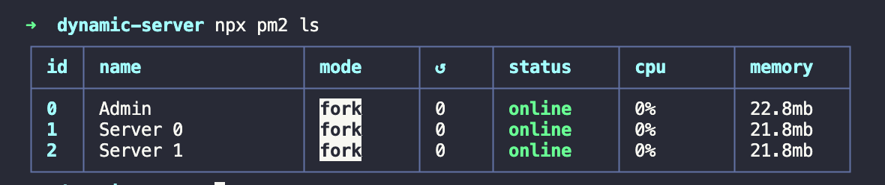

# Start Admin Process
npx pm2 start public/process_admin.json

## Process List
npx pm2 ls

## Kill Process
npx pm2 kill

## Process Add
To add new processes, edit the public/process.json file and make the request to the route below

```javascript
    POST http://localhost:3000
```

Screen

